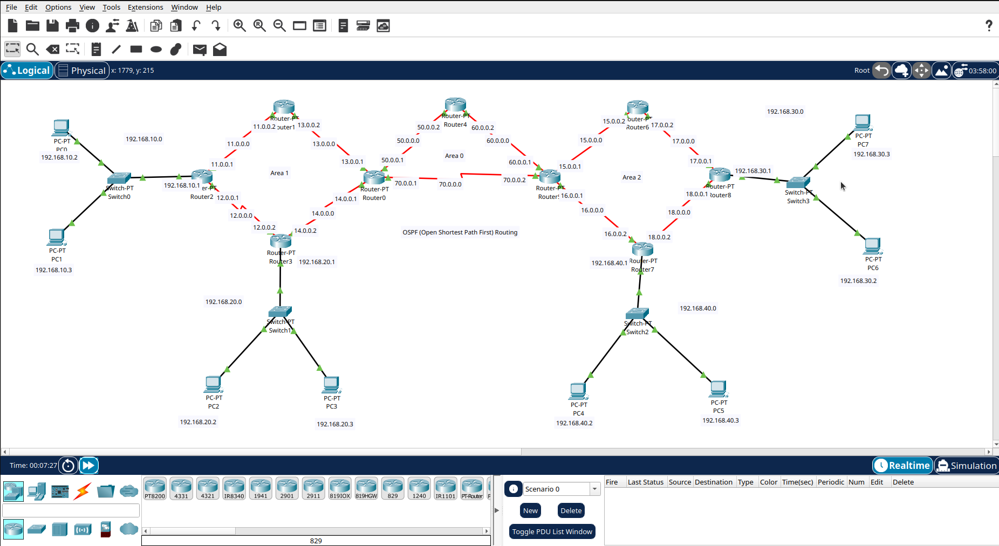
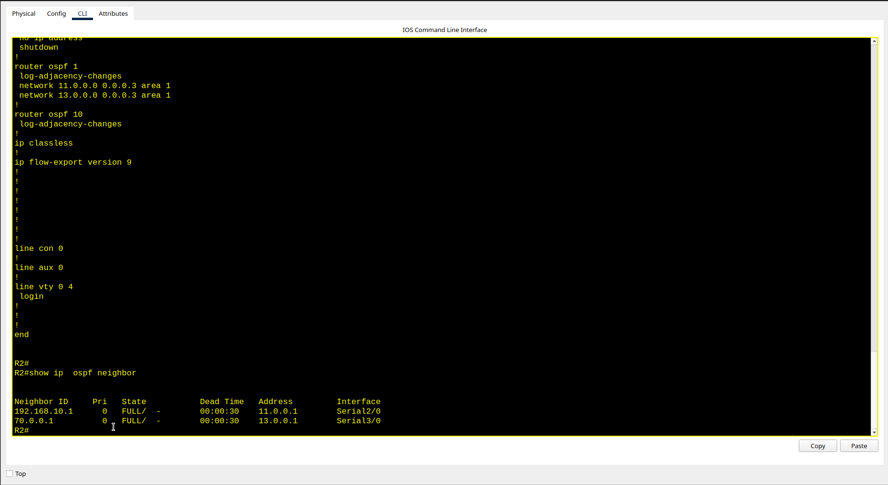
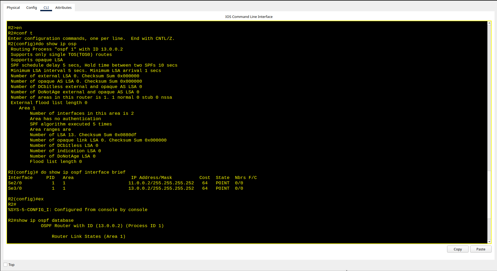
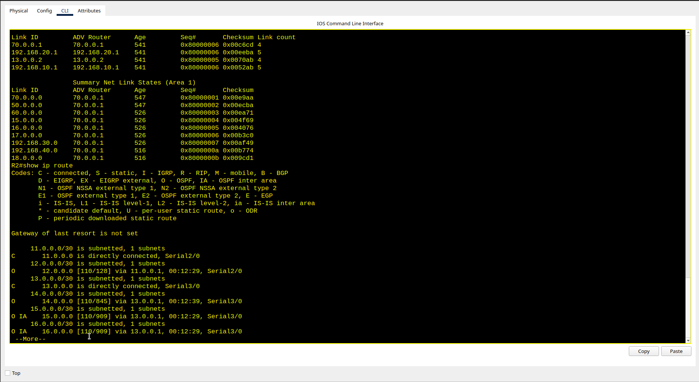
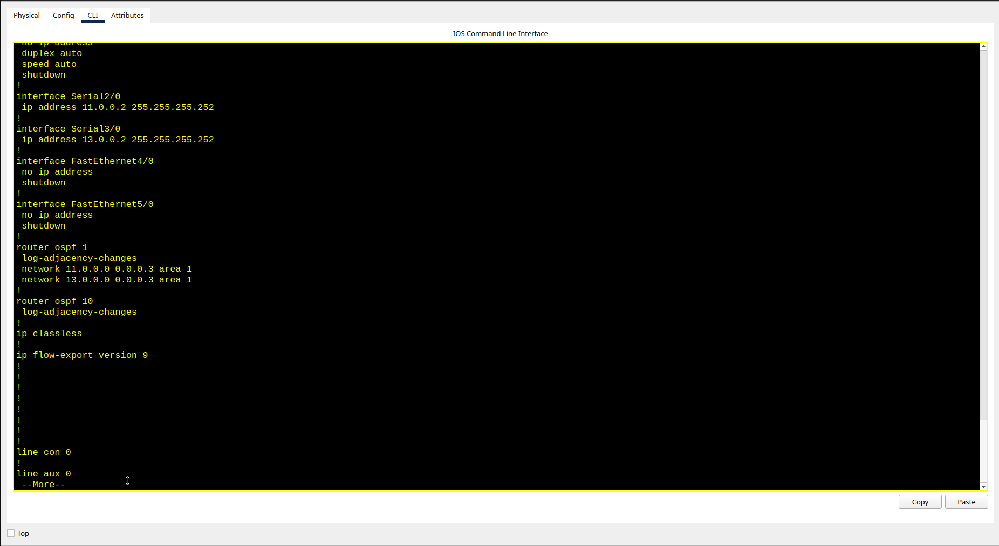

# Design-and-Configuration-of-Multi-Area-OSPF-Network-Architecture
Designed and configured a Multi-Area OSPF network in Cisco Packet Tracer with 9 routers, 4 switches, and multiple PCs. Implemented Area 0 as the backbone area and enabled inter-area routing across three OSPF areas. Demonstrated IP addressing, subnetting, route advertisement, neighbor formation, and connectivity testing.

## Network Topoglogy

## CLI

## Demo Video
Click below to watch the demonstration:

https://github.com/shubham-55035/Design-and-Configuration-of-Multi-Area-OSPF-Network-Architecture/tree/a8e544b96141a393513a74c5d5d0b36384828591/Video
